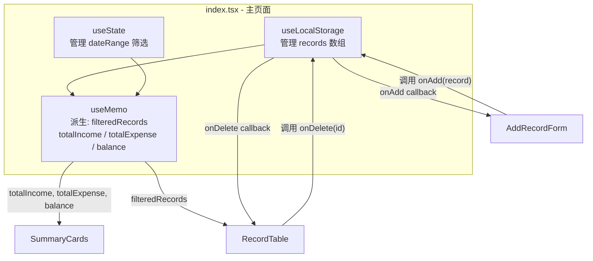
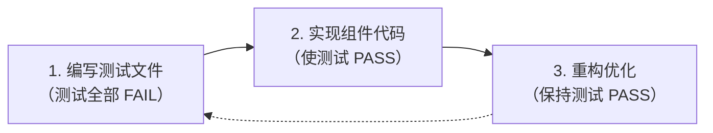

# 记账本页面实现方案

## 前置条件

项目使用 Ant Design v6，其依赖中包含 `dayjs`，但 pnpm 严格的依赖隔离导致项目无法直接 import。需要先将 `dayjs` 添加到项目的直接依赖中：

```bash
pnpm add dayjs
```

## localStorage 持久化 — 复用已有 Hook

项目已有 [`src/hooks/useLocalStorage.ts`](../../hooks/useLocalStorage.ts)，API 与 `useState` 完全一致：

```typescript
const [value, setValue] = useLocalStorage<T>(key, fallback);
```

在记账页面中直接复用，替代手动的 `loadRecords`/`saveRecords` + `useEffect`：

```typescript
const [records, setRecords] = useLocalStorage<BookkeepingRecord[]>('bookkeeping_records', []);
```

## 涉及文件

- **新建** `types.ts` — 类型定义与常量
- **新建** `SummaryCards.tsx` — 汇总卡片组件
- **新建** `AddRecordForm.tsx` — 添加记录表单
- **新建** `RecordTable.tsx` — 记录列表表格
- **新建** `index.tsx` — 主页面（状态管理 + 组装）
- **复用** `src/hooks/useLocalStorage.ts` — localStorage 持久化
- **修改** `src/App.tsx` — 添加路由
- **修改** `src/config/navigation.tsx` — 添加导航入口

## 组件架构与数据流



## 各组件设计

### 1. types.ts — 数据模型与常量

```typescript
export interface BookkeepingRecord {
  id: string;
  type: 'income' | 'expense';
  amount: number;
  category: string;
  description: string;
  date: string; // YYYY-MM-DD 格式字符串，便于序列化
}

export const INCOME_CATEGORIES = ['工资', '奖金', '投资收益', '兼职', '红包', '其他收入'];
export const EXPENSE_CATEGORIES = ['餐饮', '交通', '购物', '住房', '娱乐', '医疗', '教育', '其他支出'];
```

### 2. SummaryCards.tsx — 汇总卡片

- **Props**: `totalIncome: number`, `totalExpense: number`, `balance: number`
- **职责**: 纯展示组件，三列网格布局，分别展示收入（绿）、支出（红）、余额（紫）
- **内部**: 包含一个 `SummaryCard` 子组件，接收 `title / value / icon / color / bgGradient`
- **Ant Design 组件**: `@ant-design/icons`（RiseOutlined, FallOutlined, WalletOutlined）

### 3. AddRecordForm.tsx — 添加记录表单

- **Props**: `onAdd: (record: BookkeepingRecord) => void`
- **职责**: 表单输入与校验，生成带唯一 id 的记录并回调 `onAdd`
- **内部状态**: `selectedType`（控制分类下拉选项联动切换）
- **Ant Design 组件**: `Form`（inline 布局）、`Select`、`InputNumber`、`DatePicker`、`Input`、`Button`
- **交互**: 类型切换时自动清空分类选择；提交后重置表单，日期默认为今天

### 4. RecordTable.tsx — 记录列表

- **Props**: `records: BookkeepingRecord[]`, `onDelete: (id: string) => void`, `dateRange / onDateRangeChange`（日期筛选状态提升到父组件，因为筛选结果需同时影响 SummaryCards）
- **职责**: 展示记录列表，提供日期范围筛选 UI 和删除操作
- **Ant Design 组件**: `Table`（含排序、类型筛选）、`DatePicker.RangePicker`、`Tag`、`Popconfirm`、`Button`
- **表格列**: 日期（可排序）、类型（Tag + 筛选）、分类、金额（带颜色 + 可排序）、备注、操作（删除）

### 5. index.tsx — 主页面（状态中枢）

- **状态管理**:
  - `useLocalStorage<BookkeepingRecord[]>('bookkeeping_records', [])` — 记录数据 + 持久化
  - `useState<[Dayjs | null, Dayjs | null] | null>(null)` — 日期筛选范围
- **派生数据**（`useMemo`）:
  - `filteredRecords` — 根据 dateRange 过滤 records
  - `totalIncome / totalExpense / balance` — 根据 filteredRecords 汇总
- **回调函数**（`useCallback`）:
  - `handleAdd` — prepend 新记录到数组头部
  - `handleDelete` — 按 id 过滤删除
- **渲染**: 依次组装 SummaryCards -> AddRecordForm -> RecordTable

## 路由与导航

- `src/config/navigation.tsx`: 在 `NavPathKey` 枚举添加 `Bookkeeping = '/bookkeeping'`，在 `mainNavItems` 末尾添加导航项
- `src/App.tsx`: import Bookkeeping 组件，添加 `<Route path="/bookkeeping" element={<Bookkeeping />} />`

## UI 风格

沿用项目现有 Tailwind CSS 风格：圆角卡片（`rounded-2xl`）、渐变背景、阴影效果，与其他页面保持视觉一致。

## 测试方案（TDD）

### 测试基础设施

- 测试框架：Vitest + jsdom + @testing-library/react
- 已有 setup：`src/test/setupTests.ts` 已 mock `matchMedia`、`IntersectionObserver`、`ResizeObserver`（Ant Design 所需）
- 自定义 render：`src/test/utils.tsx` 提供包含 `BrowserRouter` 的 `render` 函数
- 风格约定：`describe` 中使用中文描述

### TDD 流程

每个组件遵循 Red-Green-Refactor 循环：



执行顺序按依赖关系从底层到顶层：types.ts (无需测试) -> SummaryCards -> AddRecordForm -> RecordTable -> index.tsx

### 测试文件与用例设计

#### 1. SummaryCards.test.tsx

```typescript
describe('SummaryCards', () => {
  describe('渲染', () => {
    it('应该渲染三张汇总卡片：总收入、总支出、余额');
    it('应该正确显示传入的总收入金额');
    it('应该正确显示传入的总支出金额');
    it('应该正确显示传入的余额');
  });

  describe('金额格式化', () => {
    it('金额应该保留两位小数');
    it('金额应该带有 ¥ 前缀');
    it('传入 0 时应显示 ¥ 0.00');
    it('大数字应该有千分位分隔符（如 ¥ 12,345.00）');
  });
});
```

测试策略：纯 props 驱动，直接 `render(<SummaryCards ... />)` 后用 `screen.getByText` 断言文本内容。

#### 2. AddRecordForm.test.tsx

```typescript
describe('AddRecordForm', () => {
  describe('渲染', () => {
    it('应该渲染类型选择器，默认值为"支出"');
    it('应该渲染金额输入框');
    it('应该渲染分类选择器');
    it('应该渲染日期选择器，默认值为今天');
    it('应该渲染备注输入框');
    it('应该渲染"添加"按钮');
  });

  describe('分类联动', () => {
    it('当类型为"支出"时，分类下拉应显示支出分类列表');
    it('当类型切换为"收入"时，分类下拉应切换为收入分类列表');
    it('类型切换时应清空已选分类');
  });

  describe('表单校验', () => {
    it('金额为空时点击添加，应显示校验错误提示');
    it('分类未选择时点击添加，应显示校验错误提示');
  });

  describe('提交', () => {
    it('填写完整信息后点击添加，应调用 onAdd 并传入正确的记录对象');
    it('提交的记录应包含唯一 id、type、amount、category、description、date 字段');
    it('提交成功后应重置表单');
  });
});
```

测试策略：使用 `vi.fn()` mock `onAdd`，`@testing-library/user-event` 模拟交互。

#### 3. RecordTable.test.tsx

```typescript
describe('RecordTable', () => {
  const mockRecords: BookkeepingRecord[] = [
    { id: '1', type: 'income', amount: 5000, category: '工资', description: '月薪', date: '2025-03-01' },
    { id: '2', type: 'expense', amount: 30, category: '餐饮', description: '午餐', date: '2025-03-02' },
    { id: '3', type: 'expense', amount: 200, category: '交通', description: '加油', date: '2025-02-15' },
  ];

  describe('渲染', () => {
    it('应该渲染"收支明细"标题');
    it('应该渲染日期范围选择器');
    it('应该渲染包含所有记录的表格');
    it('无记录时应显示空状态提示"暂无记录，开始记账吧！"');
  });

  describe('表格列展示', () => {
    it('应该正确显示每条记录的日期');
    it('收入记录应显示绿色"收入" Tag');
    it('支出记录应显示红色"支出" Tag');
    it('收入金额应以绿色和 + 号前缀展示');
    it('支出金额应以红色和 - 号前缀展示');
    it('应该显示记录的分类和备注');
  });

  describe('删除操作', () => {
    it('点击删除按钮应弹出确认框');
    it('确认删除后应调用 onDelete 并传入对应记录 id');
    it('取消删除后不应调用 onDelete');
  });

  describe('日期筛选', () => {
    it('选择日期范围后应调用 onDateRangeChange');
    it('点击"清除筛选"按钮应将日期范围重置为 null');
    it('无筛选条件时不应显示"清除筛选"按钮');
  });
});
```

#### 4. index.test.tsx — 集成测试

```typescript
describe('Bookkeeping 页面集成测试', () => {
  beforeEach(() => { localStorage.clear(); });

  describe('初始状态', () => {
    it('应该渲染页面标题"记账本"');
    it('无记录时汇总卡片应全部显示 ¥ 0.00');
    it('无记录时表格应显示空状态');
  });

  describe('添加记录', () => {
    it('添加一条支出记录后，表格应显示该记录');
    it('添加一条支出记录后，总支出和余额应更新');
    it('添加一条收入记录后，总收入和余额应更新');
    it('连续添加多条记录，汇总数据应正确累计');
  });

  describe('删除记录', () => {
    it('删除一条记录后，表格不再显示该记录');
    it('删除记录后汇总数据应同步更新');
  });

  describe('localStorage 持久化', () => {
    it('添加记录后 localStorage 应写入数据');
    it('localStorage 有已存数据时，页面加载应正确恢复记录');
  });

  describe('日期筛选与汇总联动', () => {
    it('设置日期范围后，表格只显示范围内的记录');
    it('设置日期范围后，汇总卡片只统计范围内的收支');
    it('清除筛选后，恢复显示全部记录和完整汇总');
  });
});
```

### 测试覆盖矩阵

- **types.ts**: 纯类型和常量定义，无需测试
- **SummaryCards**: 渲染正确性 + 金额格式化 (8 cases)
- **AddRecordForm**: 渲染 + 分类联动 + 校验 + 提交回调 (11 cases)
- **RecordTable**: 渲染 + 列展示 + 删除交互 + 日期筛选 (13 cases)
- **index.tsx 集成**: 初始状态 + 增删 CRUD + localStorage + 筛选联动 (12 cases)
- **合计约 44 个测试用例**

### Ant Design 组件测试注意事项

- **Select**: 需要 `fireEvent.mouseDown` 触发下拉，再 `fireEvent.click` 选项；option 在 portal 中渲染
- **DatePicker**: 在 jsdom 中交互复杂，集成测试中可通过预设 `localStorage` 数据来绕过
- **Popconfirm**: 点击触发按钮后，确认框在 portal 中渲染，用 `screen.getByText('确定')` 查找
- **Table**: 默认渲染在 `<tbody>` 中，可通过 `screen.getAllByRole('row')` 获取行
- **message**: 使用 `message.useMessage()` 的静态方法，在测试中通过 `screen.getByText` 验证
